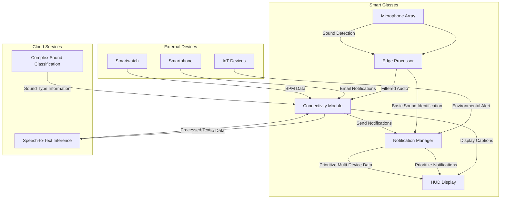

<!-- ## Simplified -->

```mermaid
graph TD

subgraph "Smart Glasses"
    A[Microphone Array]
    B[Edge Processor]
    C[Connectivity Module]
    D[Notification Manager]
    E[HUD Display]
end

subgraph "Cloud Services"
    F[Speech-to-Text Inference]
    G[Complex Sound Classification]
end

subgraph "External Devices"
    H[Smartphone]
    I[Smartwatch]
    J[IoT Devices]
end

%% Cloud-Based Inference Task
A --> B
B -->|Filtered Audio| C
C -->|Send Audio Data| F
F -->|Processed Text| C
C -->|Display Captions| E

%% Local Context Awareness Task
J -->|Environmental Alert| D
A -->|Sound Detection| B
B -->|Basic Sound Identification| D
D -->|Prioritize Notifications| E

%% Multi-Device Integration
H -->|Email Notifications| C
I -->|BPM Data| C
C -->|Send Notifications| D
D -->|Prioritize Multi-Device Data| E

%% Optional Connections
G -->|Sound Type Information| C
```

## Detailed

```mermaid
flowchart TD

%% Layer 1: Input Devices
subgraph "Input Devices"
    A1["Microphone Array"]
    A2["Camera (Optional for Gestures)"]
    A3["Smartphone Notifications"]
    A4["Smartwatch Sensors"]
    A5["IoT Device Alerts"]
end

%% Layer 2: Processing and Connectivity
subgraph "Processing and Connectivity"
    B1["Edge Processor: Sound Filtering"]
    B2["Context Analysis Module"]
    B3["Connectivity Module: Bluetooth/Wi-Fi"]
    B4["Data Synchronization Service"]
    B5["Cloud Integration for Heavy Inference"]
end

%% Layer 3: Cloud Services
subgraph "Cloud Services"
    C1["Speech-to-Text Inference"]
    C2["Advanced Sound Classification"]
    C3["Notification Routing"]
end

%% Layer 4: Output and User Interaction
subgraph "Output and Interaction"
    D1["HUD Display"]
    D2["Haptic Feedback (Optional)"]
    D3["Audio Playback for Alerts (Optional)"]
end

%% Original Smart Glasses Subsystems
subgraph "Smart Glasses Subsystem"
    E1["Microphone Array"]
    E2["Edge Processor"]
    E3["Connectivity Module"]
    E4["Notification Manager"]
    E5["HUD Display"]
end

%% Original Cloud Services
subgraph "Original Cloud Services"
    F1["Speech-to-Text Inference"]
    G1["Complex Sound Classification"]
end

%% Original External Devices
subgraph "External Devices"
    H1["Smartphone"]
    I1["Smartwatch"]
    J1["IoT Devices"]
end

%% Cloud-Based Inference Task
A1 & E1 --> B1
B1 -->|Filtered Audio| C1
C1 -->|Send Audio Data| C1
C1 -->|Processed Text| E3
E3 -->|Display Captions| D1

%% Local Context Awareness Task
J1 & A5 -->|Environmental Alerts| E4
A1 -->|Sound Detection| B1
B1 -->|Basic Sound Identification| E4
E4 -->|Prioritize Notifications| D1

%% Multi-Device Integration
H1 -->|Email Notifications| B3 & E3
I1 -->|BPM Data| B3 & E3
B3 -->|Send Notifications| E4
E4 -->|Prioritize Multi-Device Data| D1

%% Optional Connections
G1 -->|Sound Type Information| E3
```